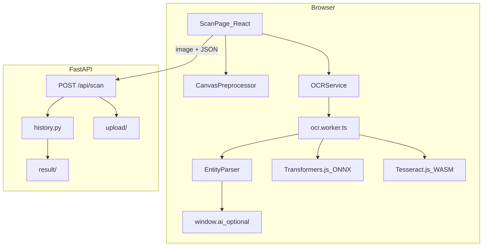

# Browser-based OCR and entity extraction

**Status:** Implemented  
**Related:** [ocr-ollama-app.md](./ocr-ollama-app.md), [vllm-deepseek-ocr-migration.md](./vllm-deepseek-ocr-migration.md), [AGENTS.md](../AGENTS.md)

## Goals

1. **100% offline inference** in the browser for product **SKU** and **expiration date** from packaged-goods photos.
2. **No server-side ML** for this path—the browser never calls vLLM/Ollama; the server stores uploads + structured JSON only.
3. **Persist scans to server History** via `POST /api/scan` (`kind: "browser_scan"`).
4. **Graceful degradation:** TrOCR (default) → PaliGemma 2 (opt-in) → Tesseract.js (fallback) → optional Chrome `window.ai` refinement.

## Architecture

## Model strategy

| Tier | Engine | Model ID | When |
|------|--------|----------|------|
| A (default) | Transformers.js | `Xenova/trocr-base-handwritten` (q8) | Auto / capable devices |
| B (opt-in) | PaliGemma | `onnx-community/paligemma2-3b-pt-224` | User selects “High quality” |
| C (fallback) | Tesseract.js | `eng` | Fast scan or VLM failure |
| D (refine) | Chrome Built-in AI | `window.ai.languageModel` | Opt-in on Scan page |

## Frontend layout

`frontend/src/browser-ocr/` — `OCRService.ts`, `ocr.worker.ts`, `preprocess.ts`, `entityParser.ts`, `modelCache.ts`, `engines/*`, `chromeAi.ts`, `types.ts`.

Route: `/scan` — `ScanPage.tsx`, hook `useBrowserOcr.ts`.

## API: POST /api/scan

Multipart: `image`, `sku`, `expiry_date?`, `confidence`, `raw_text?`, `engine`, `duration_ms`.

Record `kind: "browser_scan"` in `result/`.

## Vite / nginx

- Worker via `new URL('./ocr.worker.ts', import.meta.url)`.
- `optimizeDeps.exclude: ['@huggingface/transformers']`.
- COOP/COEP headers in dev and nginx for WASM threading.

## Implementation phases

- **Phase 1 (done):** TrOCR + Tesseract, EntityParser, `/scan`, `/api/scan`, history UI.
- **Phase 2 (done):** PaliGemma opt-in, model cache clear in Settings.
- **Phase 3 (done):** Chrome AI refinement toggle on Scan page.
