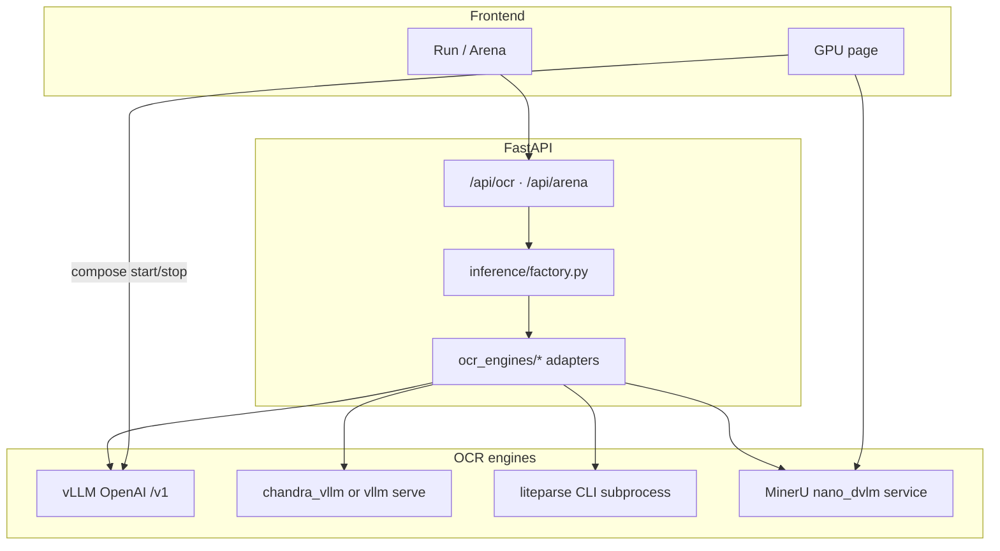

# Medium “four OCR models” — sequential integration plan

**Date:** 2026-05-15  
**Status:** Draft  
**Source:** [Which Small vLLM OCR Model Is the Best For Private Use in 2026?](https://medium.com/@AiDocTakes/i-tested-four-ocr-models-on-scanned-medical-records-and-the-smallest-one-won-ed7185b1c0b2) (companion code: [mandar-karhade/OCR-tools-public](https://github.com/mandar-karhade/OCR-tools-public))  
**Related:** [ocr-engines.md](./ocr-engines.md) (speed ranking), [vllm-deepseek-ocr-migration.md](./vllm-deepseek-ocr-migration.md), [browser-ocr-pipeline.md](./browser-ocr-pipeline.md), [issues/vllm-deepseek-ocr-integration.md](../issues/vllm-deepseek-ocr-integration.md), [issues/vllm-glm-ocr.md](../issues/vllm-glm-ocr.md)

## Goals

1. Add the **four permissive-license methods** from the article to this app’s **Run / Arena / History** flow, implemented **one model at a time** with a clear done criterion per phase.
2. Route each method through either **standard vLLM** (OpenAI `/v1/chat/completions`) or a **custom generic OCR engine** adapter when vLLM cannot serve the model.
3. Keep **browser → nginx → FastAPI only** for server OCR; no direct vLLM/engine calls from the frontend.
4. Reuse existing patterns: `vllm_endpoints.json`, `vllm_registry.py`, `inference/factory.py`, GPU compose start/stop, `prompts.json`, arena sequential runs.

## Article contenders (in scope)

| # | Name | License | Params | Engine in article | vLLM-compatible? |
|---|------|---------|--------|-------------------|------------------|
| 1 | **LightOnOCR** | Apache 2.0 | ~1B (article); HF also has 2-1B | vLLM 0.18+ + transformers ≥ 5.4 | **Yes** |
| 2 | **Chandra** | Apache 2.0 | ~3B (article); HF **Chandra OCR 2** ~4B | `chandra_vllm` / vLLM server | **Yes** (via Chandra’s vLLM path or generic serve) |
| 3 | **LiteParse** | MIT | N/A (not a neural model) | Node CLI `@llamaindex/liteparse` + Python `liteparse` | **No** — subprocess / layout extractor |
| 4 | **MinerU-Diffusion** | MIT | 2.5B | `nano_dvlm` / HF / SGLang | **No** — block diffusion decoding |

**Explicitly out of scope** (article kill list or already covered elsewhere): Marker, Surya, MinerU 2.5 (AGPL), GLM-OCR (article: cloud/API; we already have **vLLM GLM-OCR** in-repo), PaddleOCR-only, GOT-OCR2, Docling.

**Already in repo (baseline, not part of this plan’s four):** `deepseek-ai/DeepSeek-OCR`, `zai-org/GLM-OCR` on dual vLLM services.

## Target architecture



### Generic OCR engine abstraction

Extend routing beyond today’s binary `vllm` | `ollama`:

| Concept | Location | Purpose |
|---------|----------|---------|
| **Engine type** | `backend/config/ocr_engines.json` (new) | Per model: `engine`, `host_env`, `compose_service`, `input_modes`, `default_prompt` |
| **Adapter interface** | `backend/app/ocr_engines/base.py` | `async def ocr(model, prompt, image_bytes) -> (text, meta, duration_ms)` |
| **Factory** | `backend/app/inference/factory.py` | Resolve model → adapter; keep `list_models_with_classification()` unified |
| **vLLM path** | Existing `vllm_client.py` | LightOnOCR, Chandra when served as OpenAI API |
| **Custom paths** | `liteparse_engine.py`, `mineru_diffusion_engine.py` | HTTP to sidecar or subprocess with timeouts |

**`ocr_engines.json` sketch (per catalog entry):**

```json
{
  "engines": [
    {
      "id": "lighton",
      "type": "vllm",
      "label": "LightOnOCR",
      "models": ["lightonai/LightOnOCR-2-1B"],
      "host_env": "VLLM_LIGHTON_HOST",
      "default_host": "http://vllm-lighton:8102",
      "compose_service": "vllm-lighton",
      "gpu_device": 0,
      "port": 8102,
      "vllm_flags": ["--limit-mm-per-prompt", "{\"image\": 1}"]
    },
    {
      "id": "mineru-diffusion",
      "type": "nano_dvlm",
      "label": "MinerU-Diffusion",
      "models": ["opendatalab/MinerU-Diffusion-V1-0320-2.5B"],
      "host_env": "MINERU_DIFFUSION_HOST",
      "default_host": "http://mineru-diffusion:8200"
    },
    {
      "id": "litparse",
      "type": "litparse",
      "label": "LiteParse",
      "models": ["litparse"],
      "input_modes": ["pdf", "image"],
      "lit_binary_env": "LITEPARSE_BIN"
    }
  ]
}
```

**Migration path:** Merge `vllm_endpoints.json` into `ocr_engines.json` (or have `vllm_registry` read the unified file) so DeepSeek/GLM and new models share one registry. Do this in **Phase 0** before adding model #1.

### Input normalization (article benchmark parity)

Article pipeline: PDF pages → **200 DPI**, longest side **≤ 1540px**, then OCR.

| Today | Gap | Plan |
|-------|-----|------|
| Upload **images only** (`ALLOWED_CONTENT_TYPES`) | No PDF | **Phase 0b** (optional but recommended before Arena fairness): `POST /api/ocr` accept `application/pdf`, render pages server-side (`pypdfium2` or `pdf2image`), run per-page OCR, concatenate or return page array in result JSON |
| Variable client resolution | Unfair arena | Shared `app/preprocess.py`: `normalize_page_image(bytes) -> bytes` applied for all GPU models before adapter call |
| LiteParse | Native PDF text | Bypass image render when `engine=litparse` and input is PDF |

### vLLM image baseline

Article used **vLLM ≥ 0.18** and **transformers ≥ 5.4** for LightOnOCR. Current Compose default is `vllm/vllm-openai:latest` with generic fallback in `docker/vllm-entrypoint.sh`.

**Action:** Add `docker/Dockerfile.vllm-ocr` (optional build arg):

```dockerfile
FROM vllm/vllm-openai:latest
RUN pip install --no-cache-dir --force-reinstall "transformers>=5.4.0"
```

Use for **LightOnOCR** and **Chandra** services; keep DeepSeek/GLM on existing image until validated.

---

## Implementation order (one-by-one)

Recommended order: **easiest vLLM integrations first**, then non-vLLM engines. Each phase ends with Run + Arena + History + `issues/` note if non-trivial.

### Phase 0 — Registry and engine router (prerequisite)

**Done when:** New model can be added by editing config only; factory dispatches by `engine.type`.

- [ ] Add `backend/config/ocr_engines.json`; teach `vllm_registry.py` (or rename to `ocr_registry.py`) to load all engine types.
- [ ] Add `backend/app/ocr_engines/` package: `base.py`, `vllm_adapter.py` (wrap current `vllm_client.ocr_chat`).
- [ ] Update `inference/factory.py` to call registry → adapter.
- [ ] Extend `classify.py` name patterns: `lighton`, `chandra`, `mineru`, `litparse`.
- [ ] `.env.example`: host env vars for new services.
- [ ] Document in AGENTS.md only after Phase 1 ships (avoid doc churn in Phase 0).

### Phase 1 — LightOnOCR (vLLM)

**Model IDs (pick one primary for Compose):**

| HF id | Notes |
|-------|--------|
| `lightonai/LightOnOCR-2-1B` | Article-era successor; best bench in HF blog |
| `lightonai/LightOnOCR-1B-1025` | Article’s ~1B reference |
| `lightonai/LightOnOCR-2-1B-bbox` | Optional second catalog entry for layout/bbox arena |

**Serve (reference):**

```bash
vllm serve lightonai/LightOnOCR-2-1B \
  --limit-mm-per-prompt '{"image": 1}'
```

**Tasks:**

- [x] Compose service `vllm-lighton` on port **8102** (profile `lighton`; default GPU 1 — stop GLM if VRAM tight).
- [x] `docker/vllm-entrypoint.sh` branch for `lightonocr` model names + flags above.
- [x] `prompts.json`: empty prompt (image-only per HF card).
- [x] `vllm_client.py`: no DeepSeek `vllm_xargs` for LightOn models (name guard unchanged).
- [x] Frontend `utils/models.ts`: prefer LightOn in defaults when available.
- [ ] Smoke: `curl` `/api/health`, `/api/models`, one image OCR, one arena vs DeepSeek.
- [x] Issue file: `issues/lightonocr-vllm-integration.md` (image version, VRAM, prompt).

**VRAM note:** ~1B fits comfortably beside DeepSeek on 16GB only if **one vLLM process per GPU**; use GPU page to stop unused services.

### Phase 2 — Chandra (vLLM or Chandra CLI sidecar)

**Model IDs:**

| HF id | Notes |
|-------|--------|
| `datalab-to/chandra-ocr-2` | Newer 4B; article’s “Chandra” family |
| `datalab-to/chandra` | Older checkpoint if OCR 2 too heavy |

**Integration options (choose in Phase 2 spike, document in issue):**

| Option | Pros | Cons |
|--------|------|------|
| **A. `chandra-ocr` package + `chandra_vllm` in Docker** | Official path, matches article | Extra container; license check for commercial use |
| **B. Generic `vllm serve datalab-to/chandra-ocr-2`** | Same adapter as LightOn | May need flags from Chandra docs; verify OpenAI multimodal shape |
| **C. HF backend in sidecar HTTP wrapper** | Works without vLLM | Article: 66s/page — not production; fallback only |

**Recommended:** Spike **B** first; fall back to **A** if chat template / output format differs.

**Tasks:**

- [x] Service `vllm-chandra` (port **8103**) with profile `chandra`.
- [x] Prompt: layout HTML (`ocr_layout`-style) in `prompts.json`.
- [x] Arena: slower runs; sequential arena unchanged.
- [x] Issue: `issues/chandra-vllm-integration.md` (VRAM, max_tokens, serve flags).

### Phase 3 — LiteParse (custom engine, no vLLM)

**Packages:** `npm install -g @llamaindex/liteparse`, `uv add liteparse` (evaluate license/stack fit).

**Tasks:**

- [ ] `litparse` engine adapter: subprocess with timeout, parse JSON/text output to plain string for History.
- [ ] Backend image: install Node 22 + global CLI **or** mount host `lit` binary via `LITEPARSE_BIN`.
- [ ] **PDF path:** accept PDF on `/api/ocr` when `model=litparse` (or content-type routing).
- [ ] UI: show “PDF-native extractor” badge; disable for camera capture if only PDF supported initially.
- [ ] Do **not** add GPU compose service.
- [ ] Issue: `issues/litparse-node-subprocess-integration.md` (PATH, Node in Docker).

**Expectation:** Strong on digital PDFs, weak on scanned medical pages (article) — label in UI tooltips.

### Phase 4 — MinerU-Diffusion (custom `nano_dvlm` engine)

**Repo:** [opendatalab/MinerU-Diffusion](https://github.com/opendatalab/MinerU-Diffusion)  
**Weights:** `opendatalab/MinerU-Diffusion-V1-0320-2.5B`  
**Engines:** `ENGINE=nano_dvlm` (article), `hf`, `sglang` — **not** standard vLLM.

**Tasks:**

- [x] Dockerfile `docker/Dockerfile.mineru-diffusion` from upstream instructions (Python 3.12 + dev headers if `@torch.compile` enabled; article recommends **batch mode only**, skip compile on 16GB).
- [x] Compose service `mineru-diffusion` exposing a **thin HTTP wrapper** (FastAPI or minimal OpenAPI) around `generate_messages()` batch API — internal only, `MINERU_DIFFUSION_HOST`.
- [x] Adapter translates image bytes → MinerU message format; returns markdown/text (+ optional OTSL table post-process later).
- [x] GPU: dedicated GPU or swap via GPU page; document 2.5B + layout VRAM.
- [ ] Optional later: bbox/layout pipeline per article (MinerU layout + LightOn text) — **Phase 4b**, not blocking Phase 4 MVP.
- [x] Issue: `issues/mineru-diffusion-nano-dvlm-integration.md` (hallucinations, duplicate blocks, Russian glitch).

---

## Cross-cutting tasks (apply as each phase lands)

| Area | Change |
|------|--------|
| **GPU page** | Start/stop for `vllm-lighton`, `vllm-chandra`, `mineru-diffusion` via `vllm_compose.py` generalization → `ocr_compose.py` |
| **prompts.json** | Per-model entries; no DeepSeek ngram on non-DeepSeek |
| **Arena** | All four appear in model list with `available: false` when service down (existing pattern) |
| **History** | Store `engine_type`, `engine_label` in result JSON |
| **Settings** | Optional per-engine host overrides mirroring `vllm_deepseek_host` |
| **Classification** | `tier: dedicated_ocr`, `ocr_capable: true` for all four |
| **Tests** | After each phase: `uv run python -c "from app.main import app"`, manual OCR, `npm run build` |

## Compose / GPU layout (suggested defaults)

| Service | Port | GPU | When |
|---------|------|-----|------|
| `vllm-deepseek` | 8100 | 0 | Existing |
| `vllm-glm` | 8101 | 1 | Existing |
| `vllm-lighton` | 8102 | 0 or 1 | Phase 1 — stop DeepSeek if VRAM tight |
| `vllm-chandra` | 8103 | 1 | Phase 2 — often exclusive |
| `mineru-diffusion` | 8200 | 0 or 1 | Phase 4 — exclusive recommended |

**Policy:** At most **one large OCR model per GPU** unless measured headroom; GPU page is the operator control.

## Per-phase definition of done

1. Model appears in `GET /api/models` with correct `available`, `vllm_endpoint_label` / `engine_type`.
2. Run page: single image OCR saves to `upload/` + `result/`.
3. Arena: two-model compare including new model (sequential).
4. `issues/<slug>.md` written for integration pitfalls (vLLM version, VRAM, prompts).
5. Plan checklist above updated; status **In progress** → phase notes **Done**.

## Risks and decisions

| Risk | Mitigation |
|------|------------|
| vLLM image too old for LightOnOCR | `Dockerfile.vllm-ocr` + pin `VLLM_IMAGE` in `.env` |
| Too many GPU services | Swappable compose profiles: `docker-compose.medium-ocr.yml` optional overlay |
| PDF scope creep | MVP LiteParse + PDF in Phase 3; image-only for LightOn/Chandra until Phase 0b |
| MinerU maintenance burden | Isolate in own container; adapter boundary stable |
| Chandra commercial license | Document Apache 2.0 vs DataLab commercial terms in issue; no legal advice in UI |
| Arena unfairness | Shared `normalize_page_image`; same prompt family per document type |

## Optional Phase 5 — Hybrid pipeline (article recommendation)

> MinerU-Diffusion for layout bboxes → crop blocks → LightOnOCR for text.

- [ ] Backend orchestration endpoint `POST /api/ocr/pipeline` (internal or advanced UI).
- [ ] Not required for “four models one-by-one” MVP.

## Related files to touch (by phase)

| Phase | Files |
|-------|--------|
| 0 | `ocr_engines.json`, `ocr_engines/*`, `inference/factory.py`, `vllm_registry.py` |
| 1 | `docker-compose.yml`, `docker/vllm-entrypoint.sh`, `prompts.json`, `.env.example`, `frontend/src/utils/models.ts` |
| 2 | Same + possible `docker/Dockerfile.chandra` |
| 3 | `backend/Dockerfile`, `ocr_service.py`, `main.py` (PDF multipart), `litparse` adapter |
| 4 | `docker/Dockerfile.mineru-diffusion`, compose service, `mineru` adapter, `vllm_compose.py` |

## Task checklist (master)

- [ ] **Phase 0** — Engine registry + factory router
- [ ] **Phase 0b** — PDF upload + page render + normalize (recommended)
- [x] **Phase 1** — LightOnOCR via vLLM (registry extension; full Phase 0 `ocr_engines.json` deferred)
- [x] **Phase 2** — Chandra via vLLM (`vllm-chandra`)
- [ ] **Phase 3** — LiteParse custom engine
- [x] **Phase 4** — MinerU-Diffusion via nano_dvlm sidecar
- [ ] **Phase 5** (optional) — Layout + OCR pipeline

---

## Changelog

| Date | Change |
|------|--------|
| 2026-05-15 | Initial plan from Medium article + current repo architecture |
