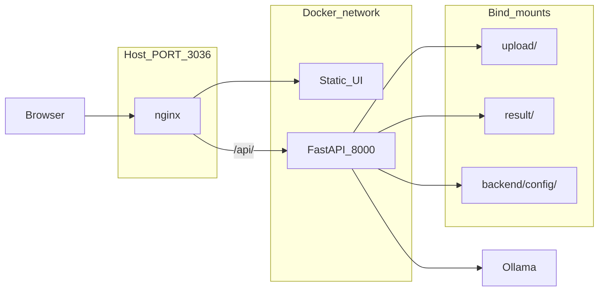

# OCR Ollama Application Plan

Implementation spec for the OCR Ollama monorepo. The application described here is **implemented**; see [README.md](../README.md) and [AGENTS.md](../AGENTS.md) for day-to-day development.

## Stack

| Layer | Choice |
|-------|--------|
| UI | Vite + React + TypeScript (`frontend/`) |
| API | Python FastAPI (`backend/app/`) |
| Python tooling | [uv](https://docs.astral.sh/uv/) — `uv sync`, `uv add`, `uv run` (not pip/venv) |
| OCR engine | Ollama (URL from Settings UI, env, or `backend/config/settings.json`) |
| Local dev | Vite proxies `/api` → `http://127.0.0.1:8000` |
| Production / compose | **nginx** on host `PORT` (default **3036**); `/` → static UI, `/api/` → backend |



---

## Model discovery and OCR eligibility

**Source:** `GET {ollama_host}/api/tags`

**Per-model metadata:** `POST {ollama_host}/api/show` with `{"name": "<model>"}`

**Classification** ([`backend/app/ollama_client.py`](../backend/app/ollama_client.py)):

| Tier | Rule |
|------|------|
| **Dedicated OCR** | Name or family contains `ocr` / `paddleocr` |
| **General vision** | `"vision"` in `capabilities` |
| **Text-only** | Neither |

- OCR picker shows dedicated + vision tiers only.
- PaddleOCR may lack `vision` in capabilities; still classified as OCR by family.

**Ollama call:**

```http
POST /api/chat
{
  "model": "<name>",
  "messages": [{ "role": "user", "content": "<prompt>", "images": ["<base64>"] }],
  "stream": false
}
```

---

## Ollama host configuration

Priority for backend URL resolution ([`backend/app/settings_store.py`](../backend/app/settings_store.py)):

1. `backend/config/settings.json` → `ollama_host` (saved from **Settings** UI; gitignored)
2. `OLLAMA_HOST` environment variable (default `http://localhost:11434`)
3. Docker Compose default: `http://host.docker.internal:11434` via `.env`

**API:**

- `GET /api/settings` — current host
- `PUT /api/settings` — save host, validate URL, return health check

**UI:** Settings → editable **OLLAMA_HOST**, Save / Save & test.

---

## Prompt system

File: [`backend/config/prompts.json`](../backend/config/prompts.json) (tracked in git)

**Resolution:** request override → `per_model[model]` → `general`

**API:** `GET/PUT /api/prompts`, `DELETE /api/prompts/{model_name}`

---

## Core features

### Image input

- Upload: drag-drop, file picker (JPEG/PNG/WebP/GIF, max 10 MB).
- Camera: `getUserMedia` → canvas capture → same multipart pipeline.
- Client never calls Ollama directly.

### Single OCR — `POST /api/ocr`

`multipart`: `image`, `model`, optional `prompt` → saves `upload/{uuid}.ext`, `result/{id}.json`, returns record.

### Arena — `POST /api/arena`

`multipart`: `image`, `models` (JSON array, 2–6), optional `prompt_overrides` (JSON object). Sequential Ollama calls; one `result/{arena_id}.json`.

### History

- `GET /api/history` — summaries, newest first
- `GET /api/history/{id}` — full record
- `DELETE /api/history/{id}` — delete JSON only (uploads kept in v1)
- `GET /api/files/upload/{filename}` — safe file serve

---

## Repository layout

```
ocr-ollama/
├── AGENTS.md                      # Agent conventions
├── plan/
│   └── ocr-ollama-app.md
├── frontend/
│   ├── package.json
│   ├── vite.config.ts             # dev: proxy /api → :8000
│   └── src/
│       ├── App.tsx
│       ├── api/client.ts
│       ├── components/            # ImageCapture, ModelPicker, ArenaGrid, Layout
│       ├── context/ImageContext.tsx
│       ├── hooks/useCamera.ts
│       └── pages/                 # Home, Arena, History, Settings
├── backend/
│   ├── pyproject.toml             # uv project ([tool.uv] package = false)
│   ├── uv.lock
│   ├── Dockerfile                 # uv sync --frozen
│   ├── config/
│   │   ├── prompts.json
│   │   └── settings.json          # gitignored; runtime Ollama URL
│   └── app/
│       ├── main.py
│       ├── ollama_client.py
│       ├── ocr_service.py
│       ├── history.py
│       ├── prompts.py
│       └── settings_store.py
├── nginx/
│   ├── Dockerfile                 # build frontend + nginx
│   └── nginx.conf
├── docker-compose.yml
├── .env / .env.example            # PORT, OLLAMA_HOST
├── upload/                        # gitignored
├── result/                        # gitignored
└── README.md
```

---

## Docker Compose

| Service | Role |
|---------|------|
| `nginx` | Publishes `${PORT:-3036}:80`; SPA + `/api/` proxy |
| `backend` | Internal `:8000`; not published |

```bash
cp .env.example .env
docker compose up --build -d
# http://localhost:3036
```

**`.env` keys:** `PORT`, `OLLAMA_HOST` (and optional `OLLAMA_TIMEOUT`, `MAX_IMAGE_BYTES`).

Volumes: `./upload`, `./result`, `./backend/config`.

---

## `.gitignore` (summary)

- `upload/*`, `result/*` (keep `.gitkeep`)
- `frontend/node_modules/`, `frontend/dist/`
- `backend/.venv/`, `__pycache__/`
- `.env`, `backend/config/settings.json`

---

## Frontend routes

| Route | Purpose |
|-------|---------|
| `/` | Upload/camera, single OCR, prompt preview |
| `/arena` | Multi-model compare (2–6) |
| `/history` | Past runs, filter, detail |
| `/settings` | Ollama host, general + per-model prompts |

Shared image state: `ImageContext` across Run and Arena.

---

## Backend details

- **httpx** async to Ollama; timeout default 300s.
- **CORS:** Vite origins in dev; production same-origin via nginx.
- **Paths:** `ROOT` = repo root in container (`/app`); `upload/` and `result/` under `ROOT`.
- **Errors:** HTTP 502/503 with Ollama detail; 400 for validation.

### Local development

```bash
# Backend
cd backend && uv sync
export OLLAMA_HOST=http://localhost:11434
uv run uvicorn app.main:app --reload --host 127.0.0.1 --port 8000

# Frontend
cd frontend && npm install && npm run dev
# http://localhost:5173
```

---

## API overview

| Method | Path | Description |
|--------|------|-------------|
| GET | `/api/health` | Ollama reachability |
| GET/PUT | `/api/settings` | Ollama host URL |
| GET | `/api/models` | Models + OCR tiers |
| GET/PUT | `/api/prompts` | Prompt config |
| DELETE | `/api/prompts/{model}` | Clear per-model prompt |
| POST | `/api/ocr` | Single-model OCR |
| POST | `/api/arena` | Multi-model compare |
| GET | `/api/history` | List runs |
| GET | `/api/history/{id}` | Run detail |
| DELETE | `/api/history/{id}` | Delete run |
| GET | `/api/files/upload/{filename}` | Image file |

---

## Implementation status

| Phase | Status |
|-------|--------|
| Scaffold, models, prompts, health | Done |
| OCR, upload/camera, persistence | Done |
| Arena, history | Done |
| Settings (Ollama host + prompts) | Done |
| Docker Compose + nginx single port | Done |
| uv for all Python deps | Done |

---

## Testing checklist

- [x] `/api/models` classifies OCR vs text-only correctly
- [x] Upload saves under `upload/`
- [ ] OCR returns text with `deepseek-ocr` or similar (depends on Ollama/GPU)
- [x] Arena writes one `result/*.json` with multiple models
- [x] History lists runs; per-model prompt overrides general
- [x] `upload/` and `result/` not tracked by git
- [x] Docker serves UI + API on `PORT` from `.env`
- [x] Settings can persist `OLLAMA_HOST`

---

## Risks and mitigations

| Risk | Mitigation |
|------|------------|
| Large models OOM / slow | Sequential arena; show duration; prefer smaller OCR models |
| PaddleOCR without `vision` flag | Classify by family; clear UI error |
| CORS / exposing Ollama | Browser → nginx/backend only |
| `localhost` in settings breaks Docker | Use `host.docker.internal` in Settings or `.env` |
| Disk growth | History delete; prune `upload/` periodically |
