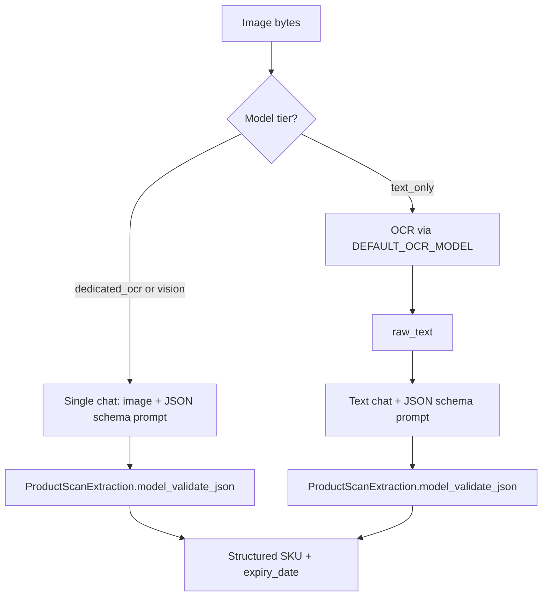

# Pydantic SKU + ED (expiry date)

**Date:** 2026-05-15  
**Status:** Implemented  
**Related:** [browser-ocr-pipeline.md](./browser-ocr-pipeline.md), [AGENTS.md](../AGENTS.md)

## Goals

1. Enforce structured **`sku`** and **`expiry_date`** (ED) with Pydantic on the backend.
2. **Vision tier** (`dedicated_ocr`, `vision`): one inference call — image → JSON → validate.
3. **Text-only tier**: OCR with default vision/OCR model → text → structured text call → validate.
4. Validate browser **`POST /api/scan`** payloads with the same schema.
5. New **`POST /api/ocr/product`** for server-side product extraction (does not change free-text `/api/ocr`).

## Architecture

## Tasks

- [x] Plan doc in `plan/`
- [x] `backend/app/schemas/scan.py` — `ProductScanExtraction`, `parse_extraction`, scan submit/record models
- [x] `backend/app/inference/classify.py` — `is_vision_tier()`
- [x] `backend/app/inference/structured.py` — prompts, JSON extract, structured chat helpers
- [x] `backend/app/product_scan.py` — tier router + `run_product_ocr`
- [x] `POST /api/ocr/product` in `main.py`
- [x] Pydantic validation in `scan_service.py`
- [x] `DEFAULT_OCR_MODEL` in `config.py` + `.env.example`
- [x] History preview for `kind: product_scan`

## API

| Route | Purpose |
|-------|---------|
| `POST /api/ocr/product` | `image`, `model` → `{ sku, expiry_date, pipeline, duration_ms, ... }` |
| `POST /api/scan` | Unchanged multipart; fields validated via Pydantic |
| `POST /api/arena` | `extraction_mode=text` (default) or `product` — per-model SKU + expiry |

## Out of scope

- Rename `expiry_date` → `ed`
- Frontend Run page toggle for `/api/ocr/product`
