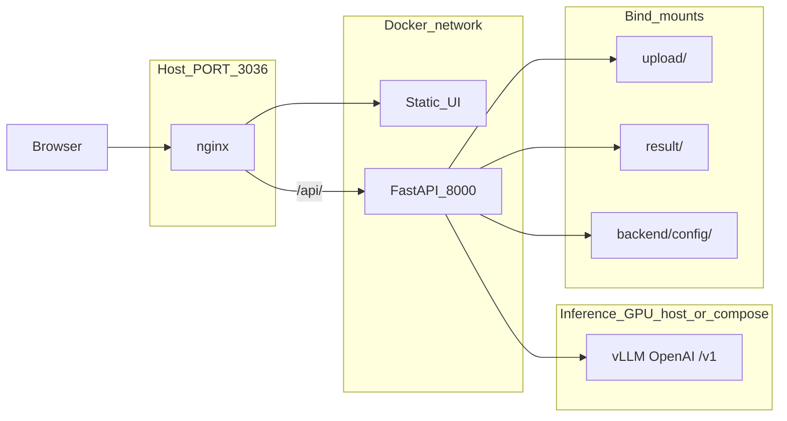

# vLLM inference migration plan (DeepSeek-OCR pilot)

**Status:** Implemented (v1: factory + vLLM client; default backend `vllm`)  
**Pilot model:** [deepseek-ai/DeepSeek-OCR](https://huggingface.co/deepseek-ai/DeepSeek-OCR) via [vLLM DeepSeek-OCR recipe](https://docs.vllm.ai/projects/recipes/en/latest/DeepSeek/DeepSeek-OCR.html)  
**Related:** [ocr-ollama-app.md](./ocr-ollama-app.md) (current Ollama stack), [issues/paddleocr-vl-ollama-load-failure.md](../issues/paddleocr-vl-ollama-load-failure.md)

## Goals

1. **Serve OCR with vLLM** instead of (or alongside) Ollama for models that Ollama cannot run or that need vLLM-specific logits processors.
2. **First target:** DeepSeek-OCR with the official vLLM flags and `NGramPerReqLogitsProcessor` for stable markdown/table output.
3. **Keep app architecture:** browser → nginx → FastAPI only; no direct vLLM calls from the frontend.
4. **Minimize UI churn:** reuse Run / Arena / History / prompts; generalize “inference host” and model list behind a small backend abstraction.

## Why vLLM (motivation)

| Pain with Ollama today | vLLM angle |
|------------------------|------------|
| `paddleocr` architecture unsupported on Ollama 0.23.x | HuggingFace weights + vLLM model registry |
| `glm-ocr` 131k ctx CUDA load failures | Explicit `max_tokens`, no Ollama `num_ctx` workaround |
| Per-model quirks scattered in `format_ollama_error()` | Single OpenAI-compatible path; model-specific options in config |
| Many local models pulled into one Ollama daemon | vLLM typically **one served model per process** (simpler ops, heavier GPU) |

vLLM is **not** a drop-in for “list 20 models from one daemon.” The product should treat vLLM as a **dedicated OCR server** (often one model) until multi-model serving is explicitly designed.

---

## Target architecture



**Principle (unchanged):** inference traffic only from `backend/app/*`, never from the browser.

### Inference backend modes (proposed)

| Mode | Env / settings | Use case |
|------|----------------|----------|
| `ollama` (default) | `INFERENCE_BACKEND=ollama`, `OLLAMA_HOST` | Current behavior; multi-model catalog |
| `vllm` | `INFERENCE_BACKEND=vllm`, `VLLM_HOST` | DeepSeek-OCR (and future HF models) |
| `hybrid` (optional later) | Both hosts; per-model routing table | Arena mixing Ollama + vLLM models |

**Recommendation for v1:** implement **`vllm` mode only** (switch whole app to vLLM) OR **`hybrid`** with a static `backend/config/inference_routing.json` mapping model id → backend. Avoid ambiguous “auto” until routing is tested.

---

## DeepSeek-OCR on vLLM (reference)

### Serve command (host or GPU container)

From the [vLLM recipe](https://docs.vllm.ai/projects/recipes/en/latest/DeepSeek/DeepSeek-OCR.html):

```bash
vllm serve deepseek-ai/DeepSeek-OCR \
  --logits_processors vllm.model_executor.models.deepseek_ocr:NGramPerReqLogitsProcessor \
  --no-enable-prefix-caching \
  --mm-processor-cache-gb 0
```

**Install (dev GPU machine):**

```bash
uv venv && source .venv/bin/activate
uv pip install -U vllm --torch-backend auto
```

Tune `--gpu-memory-utilization`, `--max-num-batched-tokens`, and tensor parallel size per GPU; document chosen values in `issues/` when hardware is fixed.

### OCR request shape (OpenAI-compatible)

vLLM exposes `POST {VLLM_HOST}/v1/chat/completions` (default port **8000** on the vLLM process — **conflicts** with FastAPI dev port; use **8001** or **8100** for vLLM in local docs).

**Messages** (multimodal):

```json
{
  "model": "deepseek-ai/DeepSeek-OCR",
  "messages": [{
    "role": "user",
    "content": [
      { "type": "image_url", "image_url": { "url": "data:image/png;base64,..." } },
      { "type": "text", "text": "Free OCR." }
    ]
  }],
  "max_tokens": 8192,
  "temperature": 0.0,
  "extra_body": {
    "skip_special_tokens": false,
    "vllm_xargs": {
      "ngram_size": 30,
      "window_size": 90,
      "whitelist_token_ids": [128821, 128822]
    }
  }
}
```

**Prompt style:** plain task strings (`"Free OCR."`, `"<image>\nFree OCR."` in offline batch), not chatty instructions — align `prompts.json` with [DeepSeek-OCR prompt examples](https://github.com/deepseek-ai/DeepSeek-OCR/blob/2ac6d64a00656693b79c4f759a5e62c1b78bbeb1/DeepSeek-OCR-master/DeepSeek-OCR-vllm/config.py#L27-L37).

**Offline batch note:** Python API uses `"prompt": "<image>\nFree OCR."` plus `multi_modal_data`; HTTP path uses `image_url` + text — backend should use **HTTP/OpenAI** only for parity with serving.

---

## API mapping: Ollama → vLLM

| App concern | Ollama today | vLLM (OpenAI API) |
|-------------|--------------|-------------------|
| Health | `GET /api/tags` | `GET /v1/models` or `GET /health` (vLLM version-dependent) |
| Model list | `GET /api/tags` + `POST /api/show` per model | `GET /v1/models` → `data[].id` |
| OCR call | `POST /api/chat` + base64 in `images[]` | `POST /v1/chat/completions` + `image_url` data URI |
| Streaming | `stream: false` | `stream: false` (keep non-streaming for v1) |
| Timing metadata | `eval_count`, `eval_duration` | `usage.completion_tokens`, wall clock in backend |
| Errors | Ollama `error` string | OpenAI-style `error.message` |

### Model classification (vLLM)

vLLM list entries lack Ollama `capabilities` / `families`. Proposed rules in `vllm_client.py`:

| Tier | Rule |
|------|------|
| **Dedicated OCR** | Model id matches `(?i)deepseek-ocr`, `paddleocr`, `glm-ocr`, or config allowlist |
| **Vision** | Optional: check served model card / static config |
| **Text-only** | Everything else (hidden from OCR picker) |

For single-model DeepSeek-OCR deployment, return one model with `tier: dedicated_ocr`, `ocr_capable: true`.

---

## Backend changes (phased)

### Phase 0 — Spike (no repo contract change)

On a GPU host:

1. Start vLLM with the serve command above.
2. `curl` `/v1/models` and one `chat/completions` with a sample PNG (data URI).
3. Record GPU model, VRAM, latency, and max image size in `issues/vllm-deepseek-ocr-spike.md`.

**Exit criteria:** stable transcription on 2–3 fixture images; markdown/table prompt tested once.

### Phase 1 — Abstraction layer

| File | Action |
|------|--------|
| `backend/app/inference/base.py` | Protocol: `list_models()`, `ocr_chat(model, prompt, image_bytes) -> (text, meta, duration_ms)`, `check_health()` |
| `backend/app/ollama_client.py` | Implement protocol (rename internally or wrap existing functions) |
| `backend/app/vllm_client.py` | **New:** OpenAI-compatible client via `httpx`; DeepSeek-OCR `extra_body` from config |
| `backend/app/inference/factory.py` | `get_inference_client()` from `INFERENCE_BACKEND` |
| `backend/app/ocr_service.py` | Call factory instead of `ollama_client` directly |
| `backend/app/main.py` | Health/settings fields generic or dual (`inference_reachable`, `inference_host`) |
| `backend/app/config.py` | `INFERENCE_BACKEND`, `VLLM_HOST`, `VLLM_TIMEOUT`, `VLLM_MODEL` (default `deepseek-ai/DeepSeek-OCR`), DeepSeek `vllm_xargs` defaults |
| `backend/config/vllm_models.json` | Optional: static tier overrides + default prompts per served id |

**Dependencies:** prefer **`httpx` only** (already used); optional `openai` SDK only if it simplifies `extra_body` — not required.

**Keep:** `get_ollama_host()` / settings UI can stay Ollama-specific until Phase 2; vLLM host from env for v1.

### Phase 2 — Settings and health UX

| Area | Change |
|------|--------|
| `settings_store.py` | `inference_backend`, `vllm_host` (gitignored `settings.json`) |
| `GET/PUT /api/settings` | Validate backend enum + URL; health probe correct service |
| `SettingsPage.tsx` | Backend selector: Ollama / vLLM; host field label follows backend |
| `GET /api/health` | Report `backend`, `reachable`, `model_count`, `served_model` (vLLM) |

**Docker:** `.env.example` adds:

```env
INFERENCE_BACKEND=vllm
VLLM_HOST=http://host.docker.internal:8100
# OLLAMA_HOST=...  # when INFERENCE_BACKEND=ollama
```

Loopback override rule (mirror Ollama): if `settings.json` has `localhost` for vLLM but `VLLM_HOST` in Compose points at `host.docker.internal`, prefer env — same pattern as [issues/docker-ollama-localhost-settings-override.md](../issues/docker-ollama-localhost-settings-override.md).

### Phase 3 — Docker / ops (optional compose service)

**Constraint:** vLLM needs NVIDIA GPU + large image; do not bundle into the slim FastAPI image.

```yaml
# sketch — not committed until GPU nodes are standard
vllm:
  image: vllm/vllm-openai:latest  # pin version
  deploy:
    resources:
      reservations:
        devices:
          - capabilities: [gpu]
  command: >
    vllm serve deepseek-ai/DeepSeek-OCR
    --logits_processors vllm.model_executor.models.deepseek_ocr:NGramPerReqLogitsProcessor
    --no-enable-prefix-caching --mm-processor-cache-gb 0
    --host 0.0.0.0 --port 8100
  ports:
    - "8100:8100"   # optional; prefer internal network only
```

**Compose:** `vllm` service in `docker-compose.yml` (GPU, `VLLM_HOST=http://vllm:8100`, HuggingFace cache volume). Optional: run vLLM on the host instead via `VLLM_HOST=http://host.docker.internal:8100`.

### Phase 4 — Prompts and Arena

| Item | Plan |
|------|------|
| `prompts.json` | Add `deepseek-ai/DeepSeek-OCR` entries: `"Free OCR."`, layout/table variants from upstream config |
| Arena | Still **sequential** calls; vLLM single-model server means Arena compares **same image against different backends** only in `hybrid` mode — document limitation |
| History JSON | Add `inference_backend` field on new runs for debugging |

### Phase 5 — Hybrid routing (optional)

`backend/config/inference_routing.json`:

```json
{
  "deepseek-ai/DeepSeek-OCR": "vllm",
  "deepseek-ocr:latest": "ollama",
  "glm-ocr:latest": "ollama"
}
```

Arena scheduler picks client per model name. Higher test burden; defer until Phase 1–2 stable.

---

## Frontend impact

| Component | Change |
|-----------|--------|
| `api/client.ts` | Types for settings/health if field names generalized |
| `ModelPicker` | No change if `/api/models` shape unchanged |
| Copy | Settings: “Inference server (Ollama or vLLM)” when unified |
| Errors | Show backend name in toast when `detail` mentions vLLM |

**No route changes.**

---

## Configuration matrix

| Variable | Default | Purpose |
|----------|---------|---------|
| `INFERENCE_BACKEND` | `ollama` | `ollama` \| `vllm` |
| `VLLM_HOST` | `http://localhost:8100` | OpenAI base (no `/v1` suffix in env; client appends `/v1/...`) |
| `VLLM_TIMEOUT` | `600` | DeepSeek-OCR can be slow on first request |
| `VLLM_MODEL` | `deepseek-ai/DeepSeek-OCR` | Default model id for OCR when server exposes one |
| `VLLM_MAX_TOKENS` | `8192` | Recipe uses 8192 offline; online example 2048 — make configurable |
| `VLLM_XARGS_*` | ngram 30, window 90 | Map to `extra_body.vllm_xargs` |

Tracked defaults for DeepSeek prompts: extend `backend/config/prompts.json` in the same PR as `vllm_client.py`.

---

## Port and naming conflicts

| Service | Typical port | Note |
|---------|--------------|------|
| FastAPI (dev) | 8000 | Unchanged |
| vLLM OpenAI server | 8000 (upstream default) | **Use 8100** (or 8008) on host to avoid clash |
| nginx (compose) | `${PORT}` → 3036 | Unchanged |
| Ollama | 11434 | Unchanged when in `ollama` mode |

Document in README: local dev runs vLLM on **8100**, `VLLM_HOST=http://127.0.0.1:8100`.

---

## Risks and mitigations

| Risk | Mitigation |
|------|------------|
| GPU required; CI cannot run vLLM | Spike on GPU machine; backend unit tests mock `httpx` responses |
| Large VRAM / OOM | One model per vLLM process; sequential Arena; env `gpu-memory-utilization` |
| vLLM / CUDA version skew | Pin `vllm` version in ops doc; record in issue spike |
| First request slow (compile/load) | Health check + UI “warming up”; longer `VLLM_TIMEOUT` |
| Only one model per vLLM instance | UI model list reflects `/v1/models`; Arena “multi-model” may need multiple vLLM ports or stay Ollama-only for compare |
| `extra_body` not supported by all HTTP clients | Use raw `httpx` POST with full JSON body |
| Repo name `ocr-ollama` | Keep name; describe stack as “OCR app with pluggable inference (Ollama or vLLM)” in README |

---

## Testing checklist (implementation)

- [ ] vLLM serve command documented and reproducible on target GPU
- [ ] `curl $VLLM_HOST/v1/models` succeeds from backend container (Docker networking)
- [ ] `GET /api/health` → reachable when `INFERENCE_BACKEND=vllm`
- [ ] `GET /api/models` returns DeepSeek-OCR with `ocr_capable: true`
- [ ] `POST /api/ocr` returns text; `result/*.json` includes duration and backend
- [ ] Invalid image / timeout → 502/503 with clear `detail`
- [ ] Settings save + test with `VLLM_HOST`
- [ ] `INFERENCE_BACKEND=ollama` regression: existing Ollama flows unchanged
- [ ] `cd frontend && npm run build`
- [ ] `cd backend && uv run python -c "from app.main import app"`

---

## Implementation order (summary)

| Phase | Deliverable | Est. effort |
|-------|-------------|-------------|
| 0 | GPU spike + issue write-up | 0.5–1 d |
| 1 | `vllm_client.py` + inference factory + env | 1–2 d |
| 2 | Settings/health API + UI | 0.5–1 d |
| 3 | Compose/docs for external or optional `vllm` service | 0.5 d |
| 4 | Prompts tuned for DeepSeek-OCR plain prompts | 0.25 d |
| 5 | Hybrid routing (optional) | 1–2 d |

**Suggested first PR:** Phase 0 issue doc + Phase 1 behind `INFERENCE_BACKEND=vllm` without removing Ollama.

---

## Open decisions (resolve before coding Phase 2)

1. **Rename repo / branding?** (e.g. `ocr-inference`) — defer unless product requires it.
2. **Default backend in `.env.example`:** stay `ollama` for backward compatibility; document `vllm` profile in README.
3. **Arena under vLLM-only:** disable multi-model Arena or show single-model repeat with different prompts?
4. **Pin vLLM version** on ops host vs `latest` container tag.

---

## References

- [vLLM DeepSeek-OCR Usage Guide](https://docs.vllm.ai/projects/recipes/en/latest/DeepSeek/DeepSeek-OCR.html)
- [vLLM multimodal inputs](https://docs.vllm.ai/en/latest/features/multimodal_inputs.html)
- [DeepSeek-OCR on Hugging Face](https://huggingface.co/deepseek-ai/DeepSeek-OCR)
- Current app spec: [plan/ocr-ollama-app.md](./ocr-ollama-app.md)
